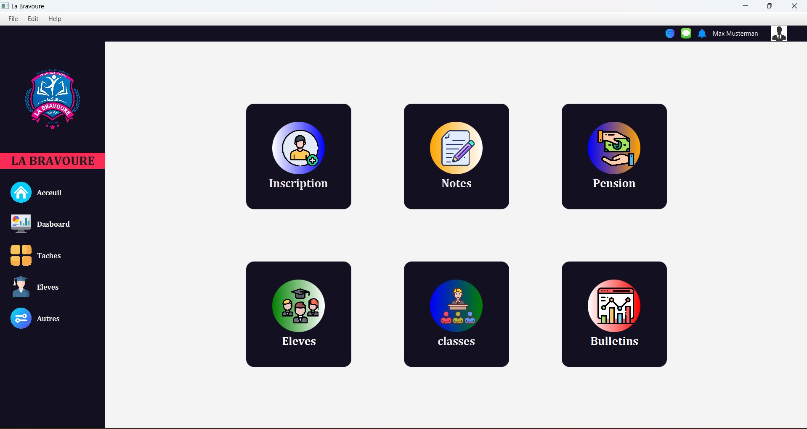
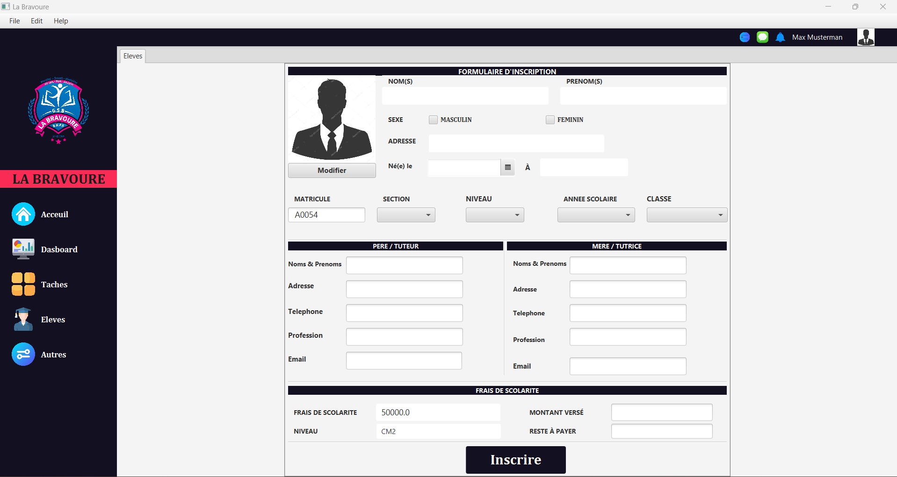

# SchoolApp

This is a JavaFX Spring Boot application designed to manage schools. It provides functionalities for managing students, teachers, courses, and classes.

## Features

- **Student Management**: Add, edit, and delete student records.
- **Teacher Management**: Manage teacher details, including adding new teachers, updating existing ones, and removing them if necessary.
- **Course Management**: Add, edit, and delete course information.
- **Class Management**: Assign teachers and students to classes, update class schedules, and manage class details.

## Prerequisites

- Java 17 or higher installed on your system.
- Maven for building and managing dependencies.
- MySQL or any other compatible relational database system.

# Screenshot

## Contributors

- Valdes Voufo  (@valdes-voufo)
- Vanol Nguemo (@nguemovanol)
- Floriane Monga
- Dilane Dongmo

## License

This project is licensed under the MIT License - see the [LICENSE](LICENSE) file for details.
